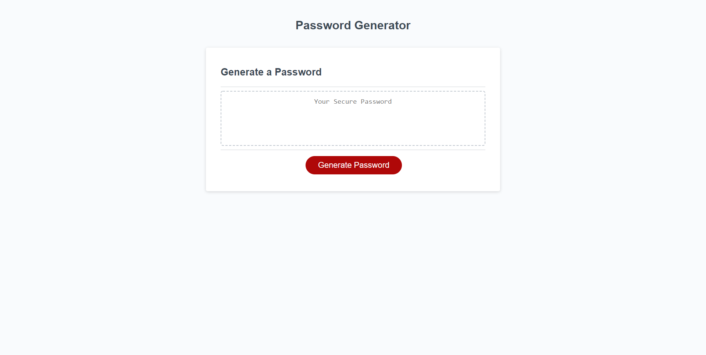

# Password Generator

Password Generator is a website created in JavaScript to generate a random password. The user has to "click" the "Generate Password" button on the webpage to initialize a series of window prompts to generate the password. First user will have to provide a number for the password length between 8 and 128. After providing a valid password length the user will have the choice on what type of characters to include in the password, User will be able to select at least one type between Lowercase Characters, Uppercase Characters, Numbers and Special Characters. Once user selctions for characters are completed, the webpage will generate a password and show it on the screen.   

## Website Screenshot

## Link to Website
[Password Generator](https://hbbc248.github.io/password-generator/)
